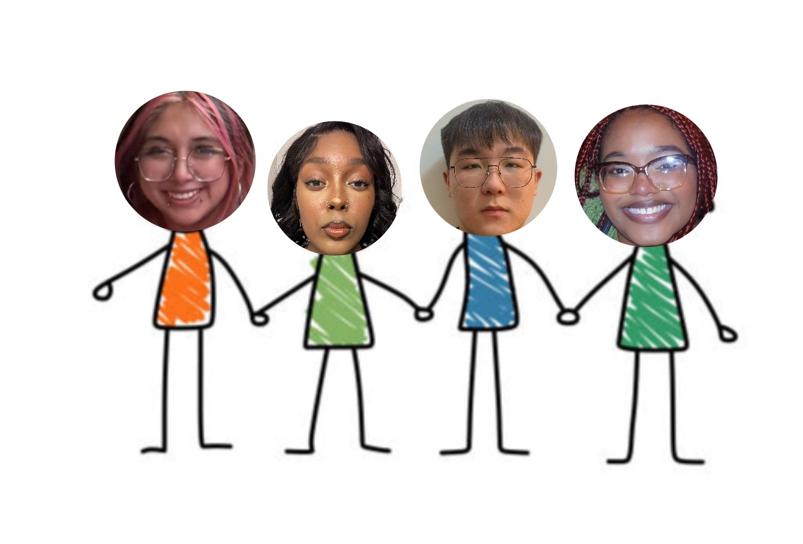

# TEAM 02

## App name: ReCraft

## Team members

-- Ana Paredes --
Diya Brown --
Rui Wang --
Jessica Williamson --

## App description
Our app facilitates and enhances the search for DIY (Do it yourself) projects. It takes in a material to search (plastic bottles, cans, cardboard, etc) and gives back a list of vlog style craft that use that material. It also adds the opportunity for the user to upload their own project and share it with the site, adding it to the database.

## Idea Proposal
[Idea Proposal](https://docs.google.com/document/d/14IJB_USPPcdBrv7OzGhTow0gGCAtvnCe/edit?usp=sharing&ouid=115900270539585947651&rtpof=true&sd=true)

## Calendar
[Calendar](https://calendar.google.com/calendar/u/0?cid=aXZoMmU3NjhzMjRkdGlxZWYwcXZvbzhxcjBAZ3JvdXAuY2FsZW5kYXIuZ29vZ2xlLmNvbQ)

## Product Backlog
* [Requirements Discovery](https://docs.google.com/document/d/13EWPcpXU_W9_QlVJDW9c6AQPQC6Q6Fb_xcey6PzoETw/edit?usp=sharing)
* [Product Backlog Validation]()
* [Product Backlog](https://docs.google.com/spreadsheets/d/1rRPT84waIOKSS-jNs7svqoX1Bdp5Rm51gihuctjPzRk/edit?usp=sharing)

## Architecture & Design
[Architecture & Design]()

## Process

### Sprint 1

* [Sprint planning]()
* [Scrums]()
* [Sprint demo video]()
* [Sprint retrospective]()

### Sprint 2

* [Sprint planning]()
* [Scrums]()
* [Sprint demo video]()
* [Sprint retrospective]()

### Sprint 3

* [Sprint planning]()
* [Scrums]()
* [Sprint demo video]()
* [Sprint retrospective]()

## Tools & APIs

## Final delivery

* [Final presentation]()
* [Poster]()
* [Process description]()

